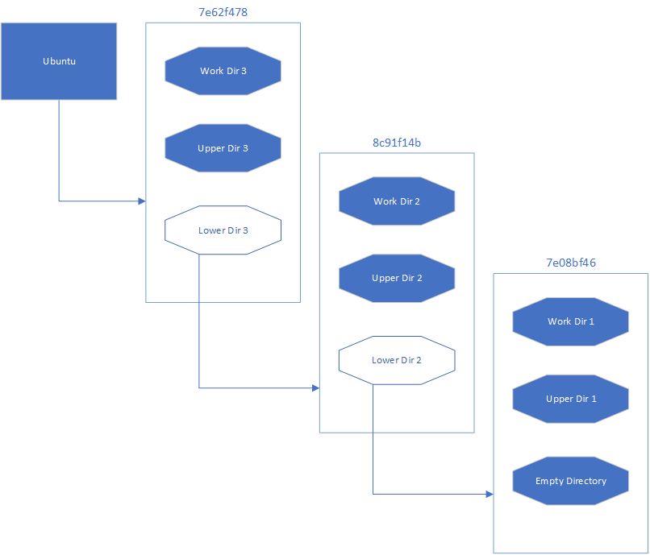

# Images
In docker, an image is an "addressable" filesystem. It's addressable because each image has a unique "name" based on it's contents.

An image consists of a list of "layers". Each "layer" has some configuration, and optionally a filesystem "delta". When all the layers are expanded in order, you get a functional image.

### Image Quick Look

Looking at the layers of the `ubuntu` image.

```bash
$> docker pull ubuntu
$> docker image inspect --format '{{ json .RootFS }}' ubuntu | jq .
{
  "Type": "layers",
  "Layers": [
    "sha256:b2fd17df207168da45a6eefccbf58eca08d05b263b3eeb365b6e4b321b18cdc8",
    "sha256:c0151ca45f2728482ee96827de759393d47cd5b6707c9f3b930cf46bd92f11b8",
    "sha256:128fa0b0fb8154f33be04e9cda2c01e88c03cde4825081ed3e0c1858cb5a3431"
  ]
}
```

If you didn't see the *exact* contents above, that means you are using a different version of the ubuntu image. There are two ways you can use a specific version of an image, the `tag` of the image, and the `sha`.

Tags are 'labels' but on specific versions of an image. They are mutable, and will often change over the course of an image. An example of this is the `latest` tag. The latest tag, by convention is the most recent stable version of the image. That means whenever a new stable version is realeased, it get's tagged with `latest`.  This means if you don't "pin" to a specific version of an image there can be major changes across runs.

Image maintainers often have multiple tags; lets look at Ubuntu's tags on [DockerHub](https://hub.docker.com/_/ubuntu). At the time of writing there are 5 major 'categories' of tags, the different major versions of the ubuntu operating system (`14.04`, `16.04`, `18.04`, `20.04`, and `20.10`). The `latest` tag is pointed at `20.04` which is not the most recent version, but the most recent *stable* version.

*Note:* When using docker and speficying an image, if there is no tag provided, docker will use `latest`.

Every release of Ubuntu will generate new tags that overwrite the existing ones. These maintainers have decided to also generate tags using `<codename>-<date>` to allow consumers to "pin" to a specific version. While this is nice, there is no way to garentee that the more specific tag won't change. To do that we need to use the image `sha`.

To get a specific version of an image, you will need to use `docker pull ubuntu:<tag>@sha256:<sha>`

Going back to the first example it would look like:

```bash
 $> docker pull ubuntu:latest@sha256:028d7303257c7f36c721b40099bf5004a41f666a54c0896d5f229f1c0fd99993
 $> docker image inspect --format '{{ json .RootFS }}' ubuntu:latest@sha256:028d7303257c7f36c721b40099bf5004a41f666a54c0896d5f229f1c0fd99993 | jq .
{
  "Type": "layers",
  "Layers": [
    "sha256:b2fd17df207168da45a6eefccbf58eca08d05b263b3eeb365b6e4b321b18cdc8",
    "sha256:c0151ca45f2728482ee96827de759393d47cd5b6707c9f3b930cf46bd92f11b8",
    "sha256:128fa0b0fb8154f33be04e9cda2c01e88c03cde4825081ed3e0c1858cb5a3431"
  ]
}
```

This output *will* be the exact same every time it's run.

#### sha256:028d730... Side Note

Where did the `sha256:028d...` come from?
```bash
$> docker inspect ubuntu:latest@sha256:028d7303257c7f36c721b40099bf5004a41f666a54c0896d5f229f1c0fd99993 --format '{{ json .RepoDigests }}'
["ubuntu@sha256:028d7303257c7f36c721b40099bf5004a41f666a54c0896d5f229f1c0fd99993","ubuntu@sha256:cbcf86d7781dbb3a6aa2bcea25403f6b0b443e20b9959165cf52d2cc9608e4b9"]
```

The sha we used before to pin the image to a specific version comes from the `RepoDigest`. Something that's computed by the Docker Registry, that's the checksum of the the "Digest" of the image. This is a N:1 relationship. There can be multiple RepoDigest's that point to the exact same image. The RepoDigest uses the image as part of it's generation. More details can be found on a [GitHub issue](https://github.com/docker/distribution/issues/1662).

## Image Creation

Layers are used to reuse common components of an image. For example, if you're building multiple applications built ontop of `ubuntu`, all of the `ubuntu` layers will be shared across all the images. This reduces download time, and space on disk.

Let's look at a [ubuntu image](https://hub.docker.com/layers/ubuntu/library/ubuntu/latest/images/sha256-028d7303257c7f36c721b40099bf5004a41f666a54c0896d5f229f1c0fd99993?context=explore).

From the UI, you can see 5 layers. The `ADD` step adds files into the image. 2-4 run commands inside the image. And the 5th sets a `CMD`.

We can see the [Dockerfile](https://github.com/tianon/docker-brew-ubuntu-core/blob/a5fc6fc792ed9dfc0ddf897178c9e05a0d2a9718/focal/Dockerfile) used to build this image.

The only required key in a Dockerfile is `FROM`. The `FROM` keyword is how you use a pre-built image as your base. Without `FROM` everyone would need to install an OS with every image, and they would take forever to build, and use a lot of disk space. In this case Ubuntu is using the `scratch` image. The `scratch` image is completely blank, and is what you use if you want to create an OS image.

*For more information on a Dockerfile, checkout Docker's documentation [here](https://docs.docker.com/engine/reference/builder/).*

From the Ubuntu example, we can see there are 5 layers, but only 3 of them have a size. If the size is 0, then there were no changes to the filesystem when building that layer.

In the first demo we looked at the `RootFS` which has 3 layers, because only 3 of the 5 layers had any filesystem (`FS`) changes.

### Image Walk Through

Before running this demo, you should make a folder that you'll delete afterwords.

First lets `save` an image then `explode` it onto disk to see how it's built.

```bash
$> docker save ubuntu:latest@sha256:028d7303257c7f36c721b40099bf5004a41f666a54c0896d5f229f1c0fd99993 -o ubuntu.tar
$> tar -tvf ubuntu.tar
drwxr-xr-x  0 0      0           0 Sep 16 15:20 7e08bf461d394ea068ee4836367cc46d4e1e47d9e848043c4b63a61b8c0e714a/
-rw-r--r--  0 0      0           3 Sep 16 15:20 7e08bf461d394ea068ee4836367cc46d4e1e47d9e848043c4b63a61b8c0e714a/VERSION
-rw-r--r--  0 0      0         401 Sep 16 15:20 7e08bf461d394ea068ee4836367cc46d4e1e47d9e848043c4b63a61b8c0e714a/json
-rw-r--r--  0 0      0    75244544 Sep 16 15:20 7e08bf461d394ea068ee4836367cc46d4e1e47d9e848043c4b63a61b8c0e714a/layer.tar
drwxr-xr-x  0 0      0           0 Sep 16 15:20 7e62f47847450305877fb42fcc0c17ba65e40ef1c09dea2a45f80c5111558d82/
-rw-r--r--  0 0      0           3 Sep 16 15:20 7e62f47847450305877fb42fcc0c17ba65e40ef1c09dea2a45f80c5111558d82/VERSION
-rw-r--r--  0 0      0        1261 Sep 16 15:20 7e62f47847450305877fb42fcc0c17ba65e40ef1c09dea2a45f80c5111558d82/json
-rw-r--r--  0 0      0        3072 Sep 16 15:20 7e62f47847450305877fb42fcc0c17ba65e40ef1c09dea2a45f80c5111558d82/layer.tar
drwxr-xr-x  0 0      0           0 Sep 16 15:20 8c91f14beadb4dcf4e11153514476e705521a0fbab80c27a1b582241a4f91b75/
-rw-r--r--  0 0      0           3 Sep 16 15:20 8c91f14beadb4dcf4e11153514476e705521a0fbab80c27a1b582241a4f91b75/VERSION
-rw-r--r--  0 0      0         477 Sep 16 15:20 8c91f14beadb4dcf4e11153514476e705521a0fbab80c27a1b582241a4f91b75/json
-rw-r--r--  0 0      0       15360 Sep 16 15:20 8c91f14beadb4dcf4e11153514476e705521a0fbab80c27a1b582241a4f91b75/layer.tar
-rw-r--r--  0 0      0        3353 Sep 16 15:20 bb0eaf4eee00c28cb8ffd54e571dd225f1dd2ed8d8751b2835c31e84188bf2de.json
-rw-r--r--  0 0      0         343 Dec 31  1969 manifest.json
$> tar -xvf ubuntu.tar
```

Also, lets make some of the exploded files more readable.

```bash
$> cat .\bb0eaf4eee00c28cb8ffd54e571dd225f1dd2ed8d8751b2835c31e84188bf2de.json |jq . > bb0eaf4eee00c28cb8ffd54e571dd225f1dd2ed8d8751b2835c31e84188bf2de.pretty.json
$> cat .\manifest.json | jq . > manifest.pretty.json
```

Lets start with `manifest.pretty.json`. This file is the first one that Docker will look at when trying to setup the container.

```json
[
  {
    "Config": "bb0eaf4eee00c28cb8ffd54e571dd225f1dd2ed8d8751b2835c31e84188bf2de.json",
    "RepoTags": null,
    "Layers": [
      "7e08bf461d394ea068ee4836367cc46d4e1e47d9e848043c4b63a61b8c0e714a/layer.tar",
      "8c91f14beadb4dcf4e11153514476e705521a0fbab80c27a1b582241a4f91b75/layer.tar",
      "7e62f47847450305877fb42fcc0c17ba65e40ef1c09dea2a45f80c5111558d82/layer.tar"
    ]
  }
]

```

As you can see there are 3 keys inside the array, `Config`, `RepoTags`, and `Layers`. We'll look at the 2 important ones `Config` and `Layers`.

The value for `Config` is a file that exists inside the tar we extracted. In a previous step we created a "pretty" version of it `bb0eaf4eee00c28cb8ffd54e571dd225f1dd2ed8d8751b2835c31e84188bf2de.pretty.json`. The `Config` file is used to build the container, which we'll get to later. We're going to start with `Layers`.

### Layers

The `Layers` field in the JSON document is is two things: an ordered list to use when building the `RootFS` and the paths to the tar files to build the `RootFS` with.

```bash
cat .\manifest.pretty.json | jq '.[] | .Layers'
[
  "7e08bf461d394ea068ee4836367cc46d4e1e47d9e848043c4b63a61b8c0e714a/layer.tar",
  "8c91f14beadb4dcf4e11153514476e705521a0fbab80c27a1b582241a4f91b75/layer.tar",
  "7e62f47847450305877fb42fcc0c17ba65e40ef1c09dea2a45f80c5111558d82/layer.tar"
]
```

If we were to look at the first file in the list it would look something like

```bash
tar -tvf 7e08bf461d394ea068ee4836367cc46d4e1e47d9e848043c4b63a61b8c0e714a/layer.tar | head
lrwxrwxrwx  0 0      0           0 Sep 15 18:19 bin -> usr/bin
drwxr-xr-x  0 0      0           0 Apr 15 04:09 boot/
drwxr-xr-x  0 0      0           0 Sep 15 18:22 dev/
drwxr-xr-x  0 0      0           0 Sep 15 18:22 etc/
-rw-------  0 0      0           0 Sep 15 18:19 etc/.pwd.lock
-rw-r--r--  0 0      0        3028 Sep 15 18:19 etc/adduser.conf
drwxr-xr-x  0 0      0           0 Sep 15 18:22 etc/alternatives/
-rw-r--r--  0 0      0         100 Mar 22 23:12 etc/alternatives/README
lrwxrwxrwx  0 0      0           0 Sep 15 18:21 etc/alternatives/awk -> /usr/bin/mawk
lrwxrwxrwx  0 0      0           0 Sep 15 18:21 etc/alternatives/nawk -> /usr/bin/mawk
```

Above only looks at the first 10 lines from the tar command, otherwise it would be overwheling. This first file is the result of the `ADD` command we saw in the Dockerfile.

When creating the "filesystem" for the container, docker goes through the `Layers` list and extracts the contents into a "[UnionFS](https://en.wikipedia.org/wiki/UnionFS)". Docker uses two implementations called [`aufs`](https://en.wikipedia.org/wiki/Aufs) and [`overlayfs`](https://en.wikipedia.org/wiki/OverlayFS).

A UnionFS is used because it prevents Docker from having to make a full copy of the container every time one is started. Instead a layer is extracted onto disk once, and then using a UnionFS to make the  two layers look like on thing. When the union is created, there are three parameters, the "lower", "upper", and "work" parts of the union. The "lower" is the previous layer, the "upper" is the current layer, the "work" of the overlap of the two.



The diagram above demonstraights how the you would "chain" UnionFS together to build a fill filesystem. When a container starts, it get's it's own link in the chain, making it possible for two containers to be running at once, using the same image on disk, but see different views of the world.

You might be wondering, if layers always build on eachother, how do you delete a file? That's a great question! In docker, deletes are done through "[whiteout](https://github.com/opencontainers/image-spec/blob/master/layer.md#whiteouts)" file. When docker extracts a layer of an image, it checks for these "whiteout" files and will delete them from the previous layer. It's accomplished by creating an empty file in the tar called `.wh.<path to remove>`. This is why in Docker you cannot have any file that starts with `.wh.`.

Useful References:
1. https://github.com/opencontainers/image-spec
2. https://insujang.github.io/2019-10-10/open-container-initiative-image-spec/

### Config

Before getting into the details of how the config file works, we need to first look at the exploded image. The chechsum's have been truncated for previty, and the `VERSION` file removed because it's not important.

```bash
Hash                      Path
----                      ----
BB0EAF4EEE00C28C...       bb0eaf4eee00c....json
72171625BF2D267E...       manifest.json
3CD2F9D46D465671...       7e08bf461d394...\json
B2FD17DF207168DA...       7e08bf461d394...\layer.tar
8C1B14B7CB19777D...       7e62f47847450...\json
128FA0B0FB8154F3...       7e62f47847450...\layer.tar
5A1A529B7682C32F...       8c91f14beadb4...\json
C0151CA45F272848...       8c91f14beadb4...\layer.tar
```

*Note:* Earlier when talking about "addressable" images, the "address" is the hash of the file. Because the hash function is `sha256`, we can almost garentee that the hashs will be unique.